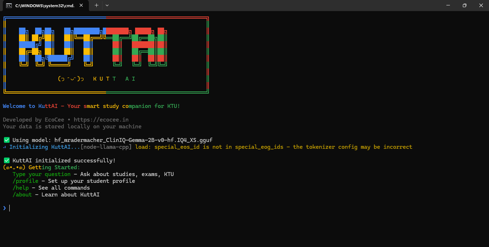

# Contributing to KuttAI


<div align="center">
  
  
  **We're excited that you're interested in contributing to KuttAI!**
</div>

## 🎯 How Can I Contribute?

### 🐛 Reporting Bugs

Found a bug? Please help us by submitting a bug report!

**Before submitting a bug report:**
1. Check if the bug hasn't been already reported in [GitHub Issues](https://github.com/cyberkutti-iedc/kuttai/issues)
2. Update to the latest version to see if the issue persists

**Writing a good bug report:**
- Use a clear and descriptive title
- Describe the exact steps to reproduce the problem
- Include screenshots or screen recordings if possible
- Share your system information (OS, Node version, etc.)
- Explain what you expected to happen vs what actually happened

### 💡 Suggesting Enhancements

Have an idea to make KuttAI better? We'd love to hear it!

**Enhancement guidelines:**
- Use a clear and descriptive title
- Provide a detailed description of the proposed enhancement
- Explain why this enhancement would be useful to most KuttAI users
- Include mockups, diagrams, or examples if applicable

### 🔧 Code Contributions

Ready to write code? Here's how to get started:

## 🚀 Your First Contribution

New to open source? Here are some beginner-friendly issues:

- [Good first issues](https://github.com/cyberkutti-iedc/kuttai/issues?q=is%3Aopen+is%3Aissue+label%3A%22good+first+issue%22)
- [Documentation improvements](https://github.com/cyberkutti-iedc/kuttai/issues?q=is%3Aopen+is%3Aissue+label%3Adocumentation)

## 📋 Development Workflow

### 1. Fork the Repository

Click the "Fork" button in the top right corner of the [repository page](https://github.com/cyberkutti-iedc/kuttai).

### 2. Clone Your Fork

```bash
git clone https://github.com/your-username/kuttai.git
cd kuttai
```

### 3. Set Upstream Remote

```bash
git remote add upstream https://github.com/cyberkutti-iedc/kuttai.git
```

### 4. Create a Feature Branch

```bash
git checkout -b feature/your-feature-name
# or
git checkout -b fix/issue-description
```

### 5. Install Dependencies

```bash
npm install
```

### 6. Make Your Changes

Follow our coding standards and make your changes.

### 7. Test Your Changes

```bash
# Run the test suite
npm test

# Test your changes manually
npm start
```

### 8. Commit Your Changes

We follow [Conventional Commits](https://www.conventionalcommits.org/) specification:

```bash
git commit -m "feat: add new command for study planning"
git commit -m "fix: resolve memory leak in model loading"
git commit -m "docs: update installation instructions"
```

### 9. Push to Your Fork

```bash
git push origin feature/your-feature-name
```

### 10. Create a Pull Request

Go to your fork on GitHub and click "New Pull Request".

## 🎨 Coding Standards

### JavaScript/Node.js Style

We use ESLint and Prettier for code formatting:

```bash
# Check code style
npm run lint

# Automatically fix style issues
npm run lint:fix
```

### Key Principles

1. **Readability**: Write code that's easy to understand
2. **Modularity**: Keep functions small and focused
3. **Documentation**: Comment complex logic and add JSDoc for functions
4. **Testing**: Write tests for new functionality

### UI Development

For UI components, follow these guidelines:

- Use the established color scheme (`src/utils/uiHelper.js`)
- Maintain consistent spacing and layout
- Ensure accessibility considerations
- Test on multiple terminal emulators

## 🧪 Testing

### Writing Tests

- Place tests in the `__tests__` directory
- Use descriptive test names
- Mock external dependencies
- Cover edge cases and error conditions

### Running Tests

```bash
# Run all tests
npm test

# Run tests with coverage
npm run test:coverage

# Run specific test file
npm test -- __tests__/model-loader.test.js
```

## 📚 Documentation

### Code Documentation

- Use JSDoc comments for all functions and classes
- Document parameters, return values, and exceptions
- Include examples for complex functions

```javascript
/**
 * Loads the AI model with specified options
 * @param {Object} options - Model loading options
 * @param {string} options.modelPath - Path to the model file
 * @param {number} options.contextSize - Context size for the model
 * @returns {Promise<Model>} Loaded model instance
 * @throws {Error} If model fails to load
 */
async function loadModel(options) {
  // function implementation
}
```

### User Documentation

- Update README.md for user-facing changes
- Add examples for new features
- Keep installation instructions current

## 🏗️ Project Structure

```
kuttai/
├── src/                    # Source code
│   ├── core/              # Core functionality
│   ├── models/            # AI model handling
│   └── index.js           # Main entry point
├── __tests__/             # Test files
├── docs/                  # Documentation
├── public/                # Static assets
```

## 🔍 Review Process

1. **Automated Checks**: GitHub Actions will run tests and linting
2. **Maintainer Review**: A maintainer will review your PR within 48 hours
3. **Feedback**: You may receive requests for changes
4. **Approval**: Once approved, your PR will be merged

## 🏆 Recognition

Contributors are recognized in:
- GitHub Contributors list
- Release notes
- Project documentation

## ❓ Need Help?

- Check existing [GitHub Issues](https://github.com/cyberkutti-iedc/kuttai/issues)
- Read the [developer documentation](https://docs.ecocee.in/kuttai/development)

## 📝 Code of Conduct

Please note that this project is released with a [Contributor Code of Conduct](CODE_OF_CONDUCT.md). By participating in this project you agree to abide by its terms.

## 🙏 Thank You!

Your contributions are greatly appreciated. Thank you for helping make KuttAI better!

---

<div align="center">
  
**Happy Coding!** 🚀


[](https://discord.gg/ecocee)
[](https://github.com/cyberkutti-iedc/kuttai/issues)

</div>